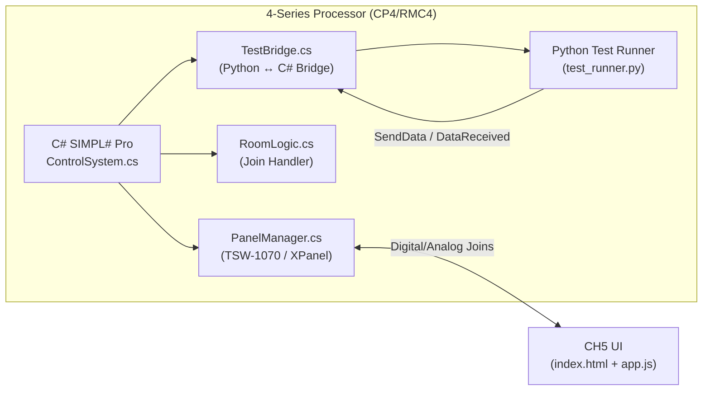

# Lockton Dunning Touch Panel Test Program

## Background & Goal

The Lockton Dunning CH5 project (`Lockton Dunning Benefits Series - Granite Park AV RFP (JT022716)`) is a Crestron HTML5 touch panel UI for **Break Room 09.002**. It targets a TSW-1070 panel and communicates with a 4-Series processor via CrComLib digital/analog joins.

**Goal:** Build a SIMPL# Pro program (C#) that runs on the 4-Series processor, manages the TSW-1070 panel, handles all the room logic behind the join map, and includes a Python-based test automation layer that can exercise every join and validate correct behavior — all without needing the physical AV hardware (displays, DSPs, switchers, etc.).

---

## Architecture Overview



### Layer Breakdown

| Layer | Language | Purpose | Runs On |
|:------|:---------|:--------|:--------|
| **Host Program** | C# (.NET 4.7) | Register panel, wire joins, implement room state machine | 4-Series Processor |
| **Room Logic** | C# | Handle source switching, volume ramping, scheduling, mute toggles | 4-Series Processor |
| **Test Bridge** | C# | Invoke Python scripts, marshal test commands/results via `PythonInterface` | 4-Series Processor |
| **Test Suite** | Python 3 | Define test cases, send simulated join pulses, assert feedback states | 4-Series Processor (via Python runtime) |
| **Development Stubs** | Python 3 | Local dry-run test harness for development on WSL2 (no processor needed) | WSL2 Workstation |

---

## User Review Required

> [!IMPORTANT]
> **Processor Target:** This plan assumes you have a CP4 or RMC4 available for deployment and testing. The C# code targets .NET 4.7 / SIMPL# Pro NuGet packages. Compilation requires Visual Studio with the Crestron SIMPL# Pro SDK installed (Windows-side tooling).

> [!WARNING]
> **Python on 4-Series Limitations:** The Crestron Python runtime is embedded CPython with a limited standard library. Third-party packages must be manually loaded to `/User/` or a program slot directory. The test suite will be designed with **zero external dependencies** to avoid packaging issues.

> [!IMPORTANT]
> **No Physical AV Hardware Required:** The C# program will include a "simulation mode" where all join feedback is echoed/looped back. This means the test suite validates the **processor ↔ panel join contract**, not the actual AV hardware behind it.

---

## Join Map Reference (Source of Truth)

Extracted from [app.js](file:///mnt/c/Users/STX/Documents/projects/ch5-workspace/html/Lockton%20Dunning%20Benefits%20Series%20-%20Granite%20Park%20AV%20RFP%20(JT022716)/js/app.js) and [GEMINI.md](file:///mnt/c/Users/STX/Documents/projects/ch5-workspace/html/Lockton%20Dunning%20Benefits%20Series%20-%20Granite%20Park%20AV%20RFP%20(JT022716)/GEMINI.md):

| Signal Name | Type | Join # | Direction | Notes |
|:---|:---|:---|:---|:---|
| Power Off | Digital | 10 | Panel→Proc | Pulse, returns to Welcome |
| Settings Modal | Digital | 11 | Panel→Proc | Pulse |
| AirMedia Select | Digital | 21 | Panel↔Proc | Pulse in, Feedback out |
| Media Player Select | Digital | 22 | Panel↔Proc | Pulse in, Feedback out |
| Master Volume | Analog | 1 | Panel↔Proc | 0–65535 |
| Master Mute | Digital | 1 | Panel↔Proc | Toggle |
| Restroom Volume | Analog | 2 | Panel↔Proc | 0–65535 |
| Restroom Mute | Digital | 2 | Panel↔Proc | Toggle |
| Handheld Mic Level | Analog | 11 | Panel↔Proc | 0–65535 |
| Handheld Mic Mute | Digital | 11 | Panel↔Proc | Toggle |
| Bodypack Mic Level | Analog | 12 | Panel↔Proc | 0–65535 |
| Bodypack Mic Mute | Digital | 12 | Panel↔Proc | Toggle |
| Sonos Previous | Digital | 41 | Panel→Proc | Pulse |
| Sonos Play/Pause | Digital | 42 | Panel→Proc | Pulse |
| Sonos Next | Digital | 43 | Panel→Proc | Pulse |
| Auto On 7am | Digital | 101 | Panel↔Proc | Select (mutually exclusive group) |
| Auto On 8am | Digital | 102 | Panel↔Proc | Select |
| Auto On 9am | Digital | 103 | Panel↔Proc | Select |
| Auto On Disable | Digital | 104 | Panel↔Proc | Select |
| Auto Off 5pm | Digital | 111 | Panel↔Proc | Select (mutually exclusive group) |
| Auto Off 6pm | Digital | 112 | Panel↔Proc | Select |
| Auto Off 7pm | Digital | 113 | Panel↔Proc | Select |
| Auto Off Disable | Digital | 114 | Panel↔Proc | Select |

---

## Proposed Changes

### Project Directory

All new files live under a new project directory:

```
/mnt/c/Users/STX/Documents/projects/lockton-test/
```

---

### C# SIMPL# Pro Program

#### [NEW] ControlSystem.cs

**Path:** `lockton-test/src/ControlSystem.cs`

The main entry point. Inherits `CrestronControlSystem`.

- Registers the TSW-1070 panel (or XPanel for WebXPanel testing)
- Instantiates `PanelManager` and `RoomLogic`
- Registers console commands for manual testing (`TESTALL`, `TESTVOL`, etc.)
- Optionally instantiates `TestBridge` to run Python automation

#### [NEW] PanelManager.cs

**Path:** `lockton-test/src/PanelManager.cs`

Encapsulates all panel SigEventHandler wiring:

- Subscribes to all digital/analog input events from the panel
- Provides methods to set digital/analog output feedback on the panel
- Translates raw `SigEventArgs` into typed callbacks for `RoomLogic`
- Exposes a `JoinState` dictionary that tracks current state of all joins

#### [NEW] RoomLogic.cs

**Path:** `lockton-test/src/RoomLogic.cs`

Implements the room state machine:

- **Source Switching:** Mutually exclusive source selection (AirMedia/MediaPlayer). When one is selected, deselect the other's feedback. On Power Off, clear all source feedbacks.
- **Volume/Mute:** Echo analog values back as feedback. Track mute toggle state per zone (Master, Restroom, Handheld, Bodypack).
- **Scheduling:** Track current auto-on/auto-off selections. Enforce mutual exclusivity within each group.
- **Sonos:** Log transport commands (no hardware to control in sim mode).
- **Power Off:** Reset all state, clear all feedbacks, send the panel back to the "empty" view.

#### [NEW] TestBridge.cs

**Path:** `lockton-test/src/TestBridge.cs`

Bridge between C# host and Python test scripts:

- Uses `PythonInterface.Run()` to launch `test_runner.py`
- Implements `DataReceived` callback to parse test commands from Python
- Exposes methods to query current `PanelManager.JoinState` and return results to Python via `PythonModule.SendData()`
- Command protocol: simple JSON strings like `{"cmd":"pulse","type":"d","join":21}` and `{"cmd":"query","type":"d","join":21}`

#### [NEW] JoinMap.cs

**Path:** `lockton-test/src/JoinMap.cs`

Static class mirroring the CH5 join map as C# constants:

```csharp
public static class JoinMap
{
    // System
    public const uint PowerOff = 10;
    public const uint SettingsModal = 11;
    // Sources
    public const uint AirMedia = 21;
    public const uint MediaPlayer = 22;
    // Volume (Analog)
    public const uint MasterLevel = 1;
    public const uint RestroomLevel = 2;
    public const uint HandheldLevel = 11;
    public const uint BodypackLevel = 12;
    // ... etc
}
```

---

### Python Test Suite

#### [NEW] test_runner.py

**Path:** `lockton-test/tests/test_runner.py`

The main test runner that operates in two modes:

1. **On-Processor Mode:** Called by `TestBridge.cs` via `PythonInterface`. Communicates via `crestron_main()` entry point and `send_data()` / `receive_data()` callbacks.
2. **Local Dry-Run Mode:** Runs on WSL2 without a processor. Uses a mock `CrestronBridge` class that simulates the C# layer in pure Python. This allows developing and debugging tests without deploying to hardware.

#### [NEW] test_cases.py

**Path:** `lockton-test/tests/test_cases.py`

Individual test case functions organized by functional group:

- `test_source_selection()` — Pulse AirMedia (d21), verify d21 feedback high and d22 low. Then pulse MediaPlayer (d22), verify d22 high and d21 low.
- `test_power_off()` — Select a source, then pulse Power Off (d10). Verify all source feedbacks go low.
- `test_master_volume()` — Set analog join 1 to 32768, verify feedback echoes 32768.
- `test_master_mute_toggle()` — Pulse d1, verify mute state toggles.
- `test_restroom_volume()` — Set analog join 2, verify feedback.
- `test_restroom_mute()` — Pulse d2, verify toggle.
- `test_mic_handheld()` — Set a11, pulse d11, verify level and mute.
- `test_mic_bodypack()` — Set a12, pulse d12, verify level and mute.
- `test_sonos_transport()` — Pulse d41/d42/d43, verify logged (no feedback expected).
- `test_schedule_on()` — Pulse d101, verify d101 high and d102/103/104 low (mutual exclusivity).
- `test_schedule_off()` — Pulse d111, verify d111 high and d112/113/114 low.
- `test_full_reset()` — Power off → verify complete state reset.

#### [NEW] mock_bridge.py

**Path:** `lockton-test/tests/mock_bridge.py`

A pure-Python simulation of the `TestBridge` + `RoomLogic` behavior for offline development:

- Maintains an in-memory join state dictionary
- Implements the same mutual-exclusivity and toggle logic as `RoomLogic.cs`
- Allows the full test suite to run on WSL2 via `python3 test_runner.py --dry-run`

---

### Configuration & Documentation

#### [NEW] GEMINI.md

**Path:** `lockton-test/GEMINI.md`

Project-specific memory file documenting the test program architecture, join map reference, and deployment instructions.

#### [NEW] README.md

**Path:** `lockton-test/README.md`

User-facing documentation covering:

- Project purpose and architecture diagram
- How to compile the C# program (Visual Studio + SIMPL# Pro SDK)
- How to deploy to a 4-Series processor
- How to run Python tests (on-processor and dry-run)
- Join map reference table

---

## Verification Plan

### Automated Tests

Since the C# code cannot be compiled on WSL2 (requires Windows Visual Studio + Crestron SDK), automated verification focuses on:

1. **Python Dry-Run Tests** (WSL2):
   ```bash
   cd /mnt/c/Users/STX/Documents/projects/lockton-test/tests
   python3 test_runner.py --dry-run
   ```
   This exercises all test cases against `mock_bridge.py` and validates:
   - Source mutual exclusivity
   - Volume echo-back
   - Mute toggle logic
   - Schedule mutual exclusivity
   - Power-off state reset

2. **Join Map Parity Check** (WSL2):
   ```bash
   cd /mnt/c/Users/STX/Documents/projects/lockton-test/tests
   python3 -c "from test_cases import verify_join_parity; verify_join_parity()"
   ```
   Compares the Python join constants against the CH5 `app.js` join map to ensure no drift between the UI contract and the test suite.

### Manual Verification

> [!NOTE]
> The following requires a physical Crestron 4-Series processor and the Crestron development tools installed on Windows.

1. **Compile:** Open `lockton-test/src/` as a SIMPL# Pro project in Visual Studio. Build → verify `.cpz` output is generated without errors.
2. **Deploy:** Load the `.cpz` to a program slot on the processor. Load `lockton_dunning.ch5z` to the panel or use WebXPanel.
3. **Console Test:** SSH into the processor, run `TESTALL` console command. Observe pass/fail output in the console.
4. **Manual UI Test:** Open the CH5 panel (physical or WebXPanel), press each button, and verify the processor console logs the expected join events. Adjust volume sliders and verify feedback updates on the panel.
